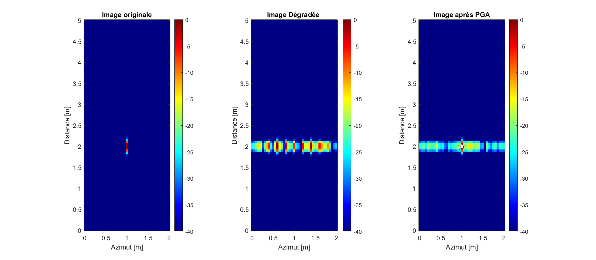
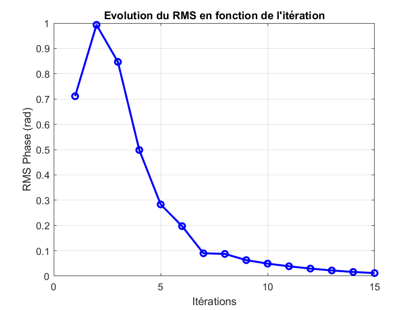

# Contexte

Ce dépôt s'inscrit dans le cadre du projet [**SAR'DINE**](https://github.com/SAR-DINE-procom), un projet universitaire de 3ème année portant sur l'étude d'un système de radar à synthèse d'ouverture (RSO / SAR : *Synthetic Aperture Radar*). On y trouve les implémentations des différents algorithmes de la chaîne de traitement d'une image SAR : formation d'image, autofocus et détection.

# Les algorithmes

## PGA (Phase Gradient Algorithm) [1]

Le *Phase Gradient Algorithm Autofocus* est un algorithme robuste qui a pour objectif de corriger des erreurs de phase dans une image SAR de manière non paramétrique.

C'est un algorithme itératif qui se déroule en 4 étapes successives :

1. Décalage circulaire
2. Fenêtrage
3. Transformation de Fourier (TF)
4. Estimation puis compensation du gradient de l'erreur de phase

Le détail du fonctionnement de cet algorithme est donné dans l'article [1] ou dans notre [rapport de projet](lien-du-rapport).

Une implémentation est proposée dans `sar/processing/pga_autofocus.m` via la fonction suivante :

```matlab
function [phase_error, corrected_image] = pga_autofocus(image, num_iterations)
```

**Entrées :**
- `image` : Image SAR à corriger.
- `num_iterations` : Nombre d'itérations de l'algorithme.

**Sorties :**
- `phase_error` : Fonction 1D de l'erreur estimée en fonction de l'azimut.
- `corrected_image` : Image corrigée après application de l'algorithme.

### Résultats 

Pour vérifier le bon fonctionnement de notre implémentation, nous avons appliqué l'algorithme à une image SAR avec une erreur de phase injectée dans le domaine de l'historique de phase. 

Sur l'image dégradée, on observe des "fantômes" de la cible le long de l'axe azimut. Après correction, l'énergie est de nouveau concentrée sur la cible et l'énergie dispersée redescend sous le niveau des lobes secondaires.


*Figure 1 : Correction par PGA sur une image dégradée par une erreur sinusoïdale.*

On constate également que la mesure du RMS est décroissante en fonction du nombre d'itérations, ce qui confirme la convergence de l'algorithme.


*Figure 2 : Évolution du RMS en fonction du nombre d'itérations.*

---

# Bibliographie

[1]. D. E. Wahl, P. H. Eichel, D. C. Ghiglia and C. V. Jakowatz, "Phase gradient autofocus-a robust tool for high resolution SAR phase correction," in *IEEE Transactions on Aerospace and Electronic Systems*, vol. 30, no. 3, pp. 827-835, July 1994, doi: 10.1109/7.303752.